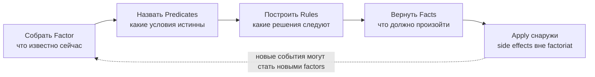
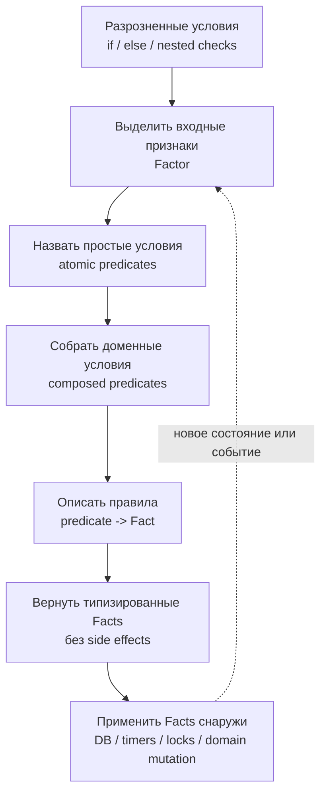

# go-factoriat

Factoriat — lightweight typed decision engine для Go.

Определение:

> Factoriat принимает снимок доменного состояния (`Factor`), прогоняет его через именованные предикаты и правила, возвращает типизированные факты-решения (`Facts`) и оставляет исполнение side effects внешнему слою.

Главная формула:

```text
Factor -> Predicates -> Rules -> Facts -> Apply
```

Это stateless-формула. Она подходит, когда решение можно принять по одному текущему снимку состояния. На вход приходит `Factor`, предикаты отвечают на вопрос “что сейчас истинно?”, правила собирают из этого facts, а внешний слой применяет side effects. Factoriat ничего не помнит между вызовами.

Например: можно ли применить купон, какой способ доставки выбрать, нужно ли отправить платёж на ручную проверку.

Для stateful-сценариев одного снимка уже недостаточно. Нужно учитывать, что factoriat видел раньше: какие факты уже были построены, какие решения должны стабилизироваться, что нельзя эмитить повторно, пока состояние не изменилось. Поэтому полный lifecycle выглядит так:

```text
Factor -> Capture -> Evaluate -> Build -> Stabilize -> Emit
```

Здесь `Capture` сохраняет входной снимок или его признаки, `Evaluate` сравнивает текущее состояние с накопленным контекстом, `Build` строит возможные facts, `Stabilize` убирает шум, дубли или нестабильные переходы, а `Emit` отдаёт только те facts, которые действительно должны выйти наружу.

Коротко:

- `Stateless` — решение по текущему `Factor`, без памяти между вызовами.
- `Stateful` — решение по текущему `Factor` плюс внутренний контекст прошлых вычислений.

## Из Каких Паттернов Собирается

Factoriat объединяет несколько известных подходов:

- **Specification / Predicate Pattern** — сложные условия получают имена и становятся доменным языком.
- **Rules Engine** — входные данные проходят через правила и дают результат.
- **Decision Table** — rules builder читается как таблица решений.
- **Domain Events / Command Facts** — результат выражен типизированными facts.
- **Separation of Decision and Execution** — факториат принимает решение, внешний слой его применяет.

## Принцип Мышления



Factoriat не должен писать в БД, создавать timers, брать locks, вызывать network или мутировать application state. Он только превращает состояние в факты.

## Алгоритм Применения



Практический ход такой:

1. Найти большой блок условий.
2. Выписать данные, от которых зависит решение, в `Factor`.
3. Назвать одиночные проверки предикатами.
4. Собрать из них композиционные доменные предикаты.
5. В `Build` оставить только правила вида `predicate -> Fact`.
6. Вернуть факты без side effects.
7. Применить факты во внешнем слое, где доступны БД, timers, locks и domain mutation.

## Stateless-Боли, Которые Это Закрывает

Эти примеры описывают ситуации, где один входной `Factor` уже содержит достаточно контекста для решения. Здесь не нужно накапливать память между вызовами: достаточно превратить текущий снимок состояния в набор typed facts.

### 1. Банковская Логика: Решение Размазано По Проверкам

Например, нужно понять, можно ли подтвердить платёж, отправить его на manual review или отклонить:

```go
if account != nil &&
	account.Active &&
	!account.Blocked &&
	payment.Amount <= account.Limit &&
	kyc.Passed &&
	!fraud.HighRisk &&
	currency.Allowed(payment.Currency) {
	// approve payment
}
```

Проблема: условия быстро растут, часть проверок начинает повторяться в разных сервисах, а изменение одного банковского правила требует искать его по коду.

Factoriat помогает превратить это в набор явных решений:

```text
PaymentShouldBeApproved
PaymentShouldGoToManualReview
PaymentShouldBeRejected
```

Применим алгоритм к этому примеру.

**Шаг 1. Найти большой блок условий**

Было:

```go
if account != nil &&
	account.Active &&
	!account.Blocked &&
	payment.Amount <= account.Limit &&
	kyc.Passed &&
	!fraud.HighRisk &&
	currency.Allowed(payment.Currency) {
	// approve payment
}
```

Здесь одновременно проверяются account, лимиты, KYC, fraud и валюта. Это уже не одно условие, а набор доменных правил.

**Шаг 2. Выписать входные признаки в Factor**

```go
type PaymentFactor struct {
	AccountFound   bool
	AccountActive  bool
	AccountBlocked bool
	AccountLimit   money.Amount

	PaymentAmount   money.Amount
	PaymentCurrency currency.Code

	KYCPassed bool
	HighRisk  bool

	CurrencyAllowed bool
}
```

`Factor` не содержит `ShouldApprove`. Он содержит только признаки, из которых решение будет выведено.

**Шаг 3. Назвать одиночные проверки предикатами**

```go
func (f PaymentFactor) accountAvailable() bool {
	return f.AccountFound && f.AccountActive && !f.AccountBlocked
}

func (f PaymentFactor) withinLimit() bool {
	return f.PaymentAmount.LessThanOrEqual(f.AccountLimit)
}

func (f PaymentFactor) compliancePassed() bool {
	return f.KYCPassed && !f.HighRisk
}
```

**Шаг 4. Собрать композиционные доменные предикаты**

```go
func (f PaymentFactor) canApprovePayment() bool {
	return f.accountAvailable() &&
		f.withinLimit() &&
		f.compliancePassed() &&
		f.CurrencyAllowed
}

func (f PaymentFactor) requiresManualReview() bool {
	return f.accountAvailable() && (f.HighRisk || !f.KYCPassed)
}
```

Теперь сложность условий осталась, но она получила доменные имена. Композиционные предикаты могут переиспользовать более простые предикаты, чтобы не дублировать проверки.

**Шаг 5. В `Build` оставить правила `predicate -> Fact`**

```go
func buildPaymentFacts(f PaymentFactor) []Fact {
	if f.canApprovePayment() {
		return []Fact{PaymentShouldBeApproved{}}
	}

	if f.requiresManualReview() {
		return []Fact{PaymentShouldGoToManualReview{}}
	}

	return []Fact{PaymentShouldBeRejected{}}
}
```

`Build` читается как таблица решений: approve, manual review, reject.

**Шаг 6. Вернуть facts без side effects**

```go
type PaymentShouldBeApproved struct{}
type PaymentShouldGoToManualReview struct{}
type PaymentShouldBeRejected struct{}
```

Факты не списывают деньги, не пишут в ledger и не отправляют события. Они только описывают решение.

**Шаг 7. Применить facts снаружи**

```go
for _, fact := range facts {
	switch fact.(type) {
	case PaymentShouldBeApproved:
		ledger.Reserve(payment.ID)
		events.PublishPaymentApproved(payment.ID)

	case PaymentShouldGoToManualReview:
		reviewQueue.Enqueue(payment.ID)

	case PaymentShouldBeRejected:
		events.PublishPaymentRejected(payment.ID)
	}
}
```

Так банковская логика становится разделённой:

```text
PaymentFactor -> predicates -> payment facts -> external side effects
```

### 2. Логистика: Много Исключений В Маршрутизации

Например, нужно выбрать способ доставки:

```go
if order.Weight < 20 &&
	warehouse.HasStock &&
	route.Available &&
	!address.RemoteArea &&
	!carrier.OnStrike &&
	weather.IsSafe {
	// ship by standard carrier
}
```

Проблема: логистика живёт исключениями. Вес, склад, регион, SLA, погода, перевозчик и таможня создают дерево условий, которое сложно читать и тестировать.

Factoriat позволяет описывать решения как факты:

```text
ShipmentShouldUseStandardCarrier
ShipmentShouldUseExpressCarrier
ShipmentShouldWaitForWarehouse
ShipmentShouldRequireManualRouting
```

Применим тот же алгоритм к логистике.

**Шаг 1. Найти большой блок условий**

Было:

```go
if order.Weight < 20 &&
	warehouse.HasStock &&
	route.Available &&
	!address.RemoteArea &&
	!carrier.OnStrike &&
	weather.IsSafe {
	// ship by standard carrier
}
```

Здесь в одном условии смешались признаки заказа, склада, маршрута, адреса, перевозчика и погоды. Когда появится новый SLA, ручной регион или исключение по таможне, условие начнёт расти в разные стороны.

**Шаг 2. Выписать входные признаки в Factor**

```go
type ShipmentFactor struct {
	OrderWeight       decimal.Decimal
	MaxStandardWeight decimal.Decimal

	WarehouseHasStock bool
	RouteAvailable    bool
	RemoteArea        bool

	CarrierOnStrike bool
	WeatherSafe     bool
	CustomsRequired bool

	ExpressAllowed bool
	SLARequiresFast bool
}
```

`ShipmentFactor` не выбирает перевозчика сам. Он только фиксирует, что известно на момент принятия решения.

**Шаг 3. Назвать одиночные проверки предикатами**

```go
func (f ShipmentFactor) weightFitsStandard() bool {
	return f.OrderWeight.LessThanOrEqual(f.MaxStandardWeight)
}

func (f ShipmentFactor) stockAvailable() bool {
	return f.WarehouseHasStock
}

func (f ShipmentFactor) routeUsable() bool {
	return f.RouteAvailable && !f.RemoteArea
}

func (f ShipmentFactor) carrierAvailable() bool {
	return !f.CarrierOnStrike
}
```

Вместо повторения `warehouse.HasStock`, `!carrier.OnStrike` и `route.Available` по разным сервисам появляются маленькие условия с доменными именами.

**Шаг 4. Собрать композиционные доменные предикаты**

```go
func (f ShipmentFactor) shipmentCanStart() bool {
	return f.stockAvailable() &&
		f.RouteAvailable &&
		f.carrierAvailable()
}

func (f ShipmentFactor) regularConditionsSafe() bool {
	return f.WeatherSafe && !f.CustomsRequired
}

func (f ShipmentFactor) expressNeeded() bool {
	return f.SLARequiresFast || f.RemoteArea
}

func (f ShipmentFactor) canUseStandardCarrier() bool {
	return f.shipmentCanStart() &&
		f.weightFitsStandard() &&
		f.routeUsable() &&
		f.regularConditionsSafe()
}

func (f ShipmentFactor) canUseExpressCarrier() bool {
	return f.shipmentCanStart() &&
		f.ExpressAllowed &&
		f.expressNeeded()
}

func (f ShipmentFactor) needsManualRouting() bool {
	return f.CustomsRequired ||
		!f.RouteAvailable ||
		!f.WeatherSafe ||
		f.CarrierOnStrike
}
```

Здесь хорошо видно отличие от большого `if`: сложные условия не исчезли, но они больше не безымянные. Общие композиционные предикаты вроде `shipmentCanStart`, `regularConditionsSafe` и `expressNeeded` убирают повторения из конкретных решений. Их можно обсуждать с бизнесом как правила маршрутизации.

**Шаг 5. В `Build` оставить правила `predicate -> Fact`**

```go
func buildShipmentFacts(f ShipmentFactor) []Fact {
	if !f.stockAvailable() {
		return []Fact{ShipmentShouldWaitForWarehouse{}}
	}

	if f.canUseStandardCarrier() {
		return []Fact{ShipmentShouldUseStandardCarrier{}}
	}

	if f.canUseExpressCarrier() {
		return []Fact{ShipmentShouldUseExpressCarrier{}}
	}

	if f.needsManualRouting() {
		return []Fact{ShipmentShouldRequireManualRouting{}}
	}

	return []Fact{ShipmentShouldRequireManualRouting{}}
}
```

`Build` становится списком решений в порядке приоритета: сначала склад, потом стандартная доставка, потом express, потом ручная маршрутизация.

**Шаг 6. Вернуть facts без side effects**

```go
type ShipmentShouldUseStandardCarrier struct{}
type ShipmentShouldUseExpressCarrier struct{}
type ShipmentShouldWaitForWarehouse struct{}
type ShipmentShouldRequireManualRouting struct{}
```

Факты не бронируют перевозчика, не меняют заказ и не отправляют уведомления. Они только говорят, какое решение принято.

**Шаг 7. Применить facts снаружи**

```go
for _, fact := range facts {
	switch fact.(type) {
	case ShipmentShouldUseStandardCarrier:
		carrier.BookStandard(order.ID)

	case ShipmentShouldUseExpressCarrier:
		carrier.BookExpress(order.ID)

	case ShipmentShouldWaitForWarehouse:
		warehouseQueue.Enqueue(order.ID)

	case ShipmentShouldRequireManualRouting:
		routingDesk.CreateTask(order.ID)
	}
}
```

Так логистика превращается из дерева исключений в читаемую цепочку:

```text
ShipmentFactor -> predicates -> shipment facts -> external side effects
```

### 3. Игровая Логика: Состояние И Правила Переплетаются

Например, в игре нужно понять, что делать с игроком после таймера:

```go
if player.InHand &&
	!player.Folded &&
	!player.AllIn &&
	table.Street != SHOWDOWN &&
	timer.Expired &&
	player.CanAct {
	// auto fold or auto check
}
```

Проблема: правила зависят от текущей фазы игры, состояния игрока, таймеров, ставок и исключений. Если смешать это с изменением стола, код становится хрупким.

Factoriat помогает отделить решение от исполнения:

```text
PlayerShouldAutoFold
PlayerShouldAutoCheck
HandShouldMoveToShowdown
PlayerShouldSitOut
```

Применим алгоритм к игровой логике.

**Шаг 1. Найти большой блок условий**

Было:

```go
if player.InHand &&
	!player.Folded &&
	!player.AllIn &&
	table.Street != SHOWDOWN &&
	timer.Expired &&
	player.CanAct {
	// auto fold or auto check
}
```

Здесь одновременно проверяются состояние игрока, состояние раздачи, таймер и право действия. Если прямо внутри этого блока менять стол, карты, банк или очередь хода, решение и side effects станут одним комом.

**Шаг 2. Выписать входные признаки в Factor**

```go
type PlayerTimerFactor struct {
	TableID  table.ID
	PlayerID player.ID

	InHand bool
	Folded bool
	AllIn  bool

	Street      table.Street
	TimerExpired bool
	PlayerCanAct bool

	ToCall       chips.Amount
	ActivePlayers int
}
```

`PlayerTimerFactor` не двигает игру дальше. Он только описывает текущий снимок: кто игрок, где находится раздача, истёк ли таймер и есть ли ставка к коллу.

**Шаг 3. Назвать одиночные проверки предикатами**

```go
func (f PlayerTimerFactor) playerInDecision() bool {
	return f.InHand && !f.Folded && !f.AllIn
}

func (f PlayerTimerFactor) handRunning() bool {
	return f.Street != table.Showdown
}

func (f PlayerTimerFactor) actionTimedOut() bool {
	return f.TimerExpired && f.PlayerCanAct
}

func (f PlayerTimerFactor) hasNothingToCall() bool {
	return f.ToCall.IsZero()
}
```

Мелкие предикаты убирают шум из правил. Вместо `!player.Folded && !player.AllIn` появляется понятное доменное имя `playerInDecision`.

**Шаг 4. Собрать композиционные доменные предикаты**

```go
func (f PlayerTimerFactor) canApplyTimeoutAction() bool {
	return f.playerInDecision() &&
		f.handRunning() &&
		f.actionTimedOut()
}

func (f PlayerTimerFactor) shouldAutoCheck() bool {
	return f.canApplyTimeoutAction() &&
		f.hasNothingToCall()
}

func (f PlayerTimerFactor) shouldAutoFold() bool {
	return f.canApplyTimeoutAction() &&
		!f.hasNothingToCall()
}

func (f PlayerTimerFactor) shouldMoveToShowdownAfterFold() bool {
	return f.shouldAutoFold() && f.ActivePlayers <= 2
}
```

Здесь видно, что “таймер истёк” сам по себе ещё не решение. Решение появляется только после композиции: игрок действительно в раздаче, раздача ещё идёт, игрок может действовать, и понятно, есть ли ставка к коллу.

**Шаг 5. В `Build` оставить правила `predicate -> Fact`**

```go
func buildPlayerTimerFacts(f PlayerTimerFactor) []Fact {
	if !f.canApplyTimeoutAction() {
		return nil
	}

	if f.shouldAutoCheck() {
		return []Fact{PlayerShouldAutoCheck{}}
	}

	if f.shouldMoveToShowdownAfterFold() {
		return []Fact{
			PlayerShouldAutoFold{},
			HandShouldMoveToShowdown{},
			PlayerShouldSitOut{},
		}
	}

	if f.shouldAutoFold() {
		return []Fact{
			PlayerShouldAutoFold{},
			PlayerShouldSitOut{},
		}
	}

	return nil
}
```

`Build` больше не решает, как именно поменять стол. Он только возвращает набор фактов, которые описывают доменное решение.

**Шаг 6. Вернуть facts без side effects**

```go
type PlayerShouldAutoFold struct {
	TableID  table.ID
	PlayerID player.ID
}

type PlayerShouldAutoCheck struct {
	TableID  table.ID
	PlayerID player.ID
}

type HandShouldMoveToShowdown struct {
	TableID table.ID
}

type PlayerShouldSitOut struct {
	TableID  table.ID
	PlayerID player.ID
}
```

Факты не вызывают `Fold`, не двигают street и не меняют seat state. Они только фиксируют, что должно быть сделано внешним слоем.

**Шаг 7. Применить facts снаружи**

```go
for _, fact := range facts {
	switch fact := fact.(type) {
	case PlayerShouldAutoCheck:
		tableService.AutoCheck(fact.TableID, fact.PlayerID)

	case PlayerShouldAutoFold:
		tableService.AutoFold(fact.TableID, fact.PlayerID)

	case HandShouldMoveToShowdown:
		tableService.MoveToShowdown(fact.TableID)

	case PlayerShouldSitOut:
		tableService.MarkSitOut(fact.TableID, fact.PlayerID)
	}
}
```

Так игровая логика перестаёт быть смесью проверок и мутаций:

```text
PlayerTimerFactor -> predicates -> player timer facts -> external side effects
```

### 4. Маркетплейс: Акции, Продавцы И Риски Создают Комбинаторику

Например, нужно решить, можно ли применить скидку:

```go
if product.Active &&
	seller.Verified &&
	buyer.NotAbusive &&
	coupon.Valid &&
	cart.Total >= coupon.MinTotal &&
	!category.Excluded &&
	region.Allowed &&
	!promotion.Conflict {
	// apply coupon
}
```

Проблема: маркетплейс быстро обрастает правилами продавцов, регионов, категорий, промоакций, лимитов и антифрода. Условия начинают конфликтовать друг с другом.

Factoriat делает результат явным:

```text
CouponShouldBeApplied
CouponShouldBeRejected
PromotionConflictDetected
OrderShouldRequireRiskReview
```

Применим алгоритм к маркетплейсу.

**Шаг 1. Найти большой блок условий**

Было:

```go
if product.Active &&
	seller.Verified &&
	buyer.NotAbusive &&
	coupon.Valid &&
	cart.Total >= coupon.MinTotal &&
	!category.Excluded &&
	region.Allowed &&
	!promotion.Conflict {
	// apply coupon
}
```

Здесь в одном условии смешались товар, продавец, покупатель, купон, корзина, категория, регион и промоакции. При добавлении нового правила легко сломать старую скидку или разрешить купон там, где его применять нельзя.

**Шаг 2. Выписать входные признаки в Factor**

```go
type CouponFactor struct {
	ProductActive bool
	CategoryExcluded bool

	SellerVerified bool
	BuyerAbusive   bool
	BuyerHighRisk  bool

	CouponValid bool
	CartTotal   money.Amount
	MinTotal    money.Amount

	RegionAllowed     bool
	PromotionConflict bool
}
```

`CouponFactor` не применяет скидку и не меняет заказ. Он только собирает признаки, которые нужны для решения.

**Шаг 3. Назвать одиночные проверки предикатами**

```go
func (f CouponFactor) productEligible() bool {
	return f.ProductActive && !f.CategoryExcluded
}

func (f CouponFactor) sellerEligible() bool {
	return f.SellerVerified
}

func (f CouponFactor) buyerAllowed() bool {
	return !f.BuyerAbusive
}

func (f CouponFactor) couponAvailable() bool {
	return f.CouponValid
}

func (f CouponFactor) cartMeetsMinimum() bool {
	return f.CartTotal.GreaterThanOrEqual(f.MinTotal)
}
```

Атомарные предикаты фиксируют маленькие бизнес-смыслы. Например, `productEligible` уже лучше, чем повторять `product.Active && !category.Excluded` в разных местах checkout.

**Шаг 4. Собрать композиционные доменные предикаты**

```go
func (f CouponFactor) marketplaceAllowsCoupon() bool {
	return f.productEligible() &&
		f.sellerEligible() &&
		f.RegionAllowed
}

func (f CouponFactor) customerCanUseCoupon() bool {
	return f.buyerAllowed() &&
		!f.BuyerHighRisk
}

func (f CouponFactor) couponConditionsMet() bool {
	return f.couponAvailable() &&
		f.cartMeetsMinimum()
}

func (f CouponFactor) canApplyCoupon() bool {
	return f.marketplaceAllowsCoupon() &&
		f.customerCanUseCoupon() &&
		f.couponConditionsMet() &&
		!f.PromotionConflict
}

func (f CouponFactor) needsRiskReview() bool {
	return f.BuyerHighRisk && f.couponAvailable()
}

func (f CouponFactor) hasPromotionConflict() bool {
	return f.PromotionConflict
}
```

Теперь правила читаются слоями: сначала площадка разрешает купон, затем покупатель проходит ограничения, затем сам купон выполняет свои условия. Это снижает комбинаторику, потому что каждое большое решение собирается из понятных блоков.

**Шаг 5. В `Build` оставить правила `predicate -> Fact`**

```go
func buildCouponFacts(f CouponFactor) []Fact {
	if f.hasPromotionConflict() {
		return []Fact{PromotionConflictDetected{}}
	}

	if f.needsRiskReview() {
		return []Fact{OrderShouldRequireRiskReview{}}
	}

	if f.canApplyCoupon() {
		return []Fact{CouponShouldBeApplied{}}
	}

	return []Fact{CouponShouldBeRejected{}}
}
```

`Build` показывает порядок приоритетов: сначала конфликт промоакций, потом риск, потом применение купона, иначе отказ.

**Шаг 6. Вернуть facts без side effects**

```go
type CouponShouldBeApplied struct{}
type CouponShouldBeRejected struct{}
type PromotionConflictDetected struct{}
type OrderShouldRequireRiskReview struct{}
```

Факты не пересчитывают корзину, не списывают лимит купона и не создают тикет риска. Они только описывают принятое решение.

**Шаг 7. Применить facts снаружи**

```go
for _, fact := range facts {
	switch fact.(type) {
	case CouponShouldBeApplied:
		cart.ApplyCoupon(order.ID, coupon.ID)

	case CouponShouldBeRejected:
		events.PublishCouponRejected(order.ID, coupon.ID)

	case PromotionConflictDetected:
		promotionService.MarkConflict(order.ID)

	case OrderShouldRequireRiskReview:
		riskQueue.Enqueue(order.ID)
	}
}
```

Так маркетплейс-логика перестаёт быть набором конфликтующих условий:

```text
CouponFactor -> predicates -> coupon facts -> external side effects
```

## Установка

```bash
go get github.com/vortex14/go-factoriat
```

```go
import factoriat "github.com/vortex14/go-factoriat"
```

## Руководство

Руководство разложено по главам: от ментальной модели к практике применения.

1. [Что такое Factoriat](docs/01-what-is-factoriat.md)
2. [Базовая модель: Factor -> Predicates -> Facts -> Apply](docs/02-basic-model.md)
3. [Factor](docs/03-factor.md)
4. [Predicates](docs/04-predicates.md)
5. [Facts](docs/05-facts.md)
6. [Build Rules](docs/06-build-rules.md)
7. [Run / Stateful / Stateless](docs/07-run-stateful-stateless.md)
8. [Apply Facts](docs/08-apply-facts.md)
9. [Тестирование](docs/09-testing.md)
10. [Антипаттерны](docs/10-antipatterns.md)
