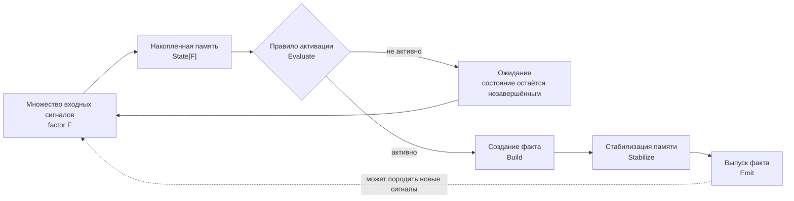
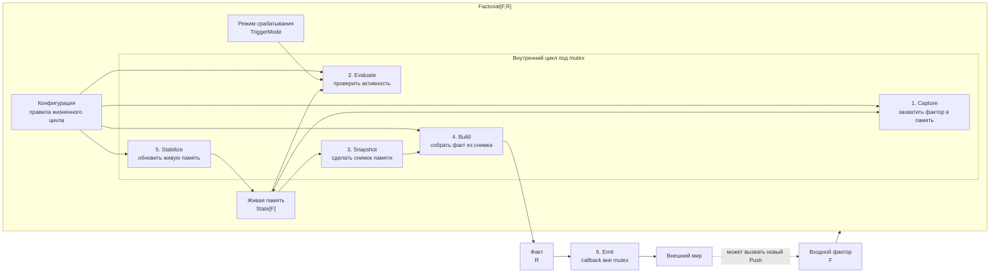
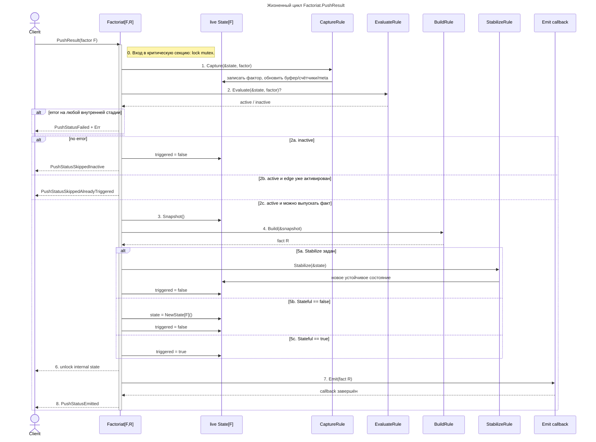

# go-factoriat

Factoriat — информационный транзистор: он принимает входной фактор, накапливает его в живой памяти, оценивает затвор активации и, при срабатывании, выпускает факт.

## Установка

```bash
go get github.com/vortex14/go-factoriat
```

```go
import factoriat "github.com/vortex14/go-factoriat"
```

## Словарь паттерна

- `factor F` — входной фактор, то есть один сигнал, который может изменить память факториата.
- `State[F]` — живая память факториата; она накапливает факторы, счётчики и доменный контекст между вызовами.
- `snapshot` — независимый снимок памяти для `Build`; его можно читать и даже случайно менять без влияния на live-state.
- `Evaluate` — затвор активации; он не создаёт факт, а только отвечает, активен ли факториат сейчас.
- `fact R` — выходной факт, собранный из снимка памяти.
- `Stabilize` — переход живой памяти в следующее устойчивое состояние после построения факта.
- `Emit` — внешний выпуск факта; этот шаг находится за пределами mutex и может породить новые входные факторы.

## Главная идея

```text
Factor -> Capture -> Evaluate -> Build -> Stabilize -> Emit -> Fact
```

`Build` получает независимый снимок памяти, поэтому не может случайно изменить live-state. `Stabilize` получает живую память и отвечает за пост-фактное состояние. `Emit` вызывается вне mutex, поэтому callback может безопасно отправлять новые факторы.

Каждый lifecycle hook возвращает ошибку. Если любой шаг возвращает `error`, lifecycle останавливается и `PushResult` возвращает `PushStatusFailed` с заполненным `Err`.

Для синхронного stateless-сценария есть `Run(factor)`: он не проходит полный lifecycle, не читает и не сохраняет live-state, не вызывает `Capture`, `Evaluate`, `Stabilize` и `Emit`. `Run` передаёт один входной фактор в `Build` через временный `State` и сразу возвращает `[]R`.

## Public API

Публичная поверхность `github.com/vortex14/go-factoriat` делится на несколько небольших групп.

### Конструирование

- `Config[F,R]` — декларация жизненного цикла факториата.
- `NewFactoriat(cfg)` — создаёт факториат и возвращает ошибку валидации.
- `MustNewFactoriat(cfg)` — создаёт факториат или паникует, если конфигурация неполная.
- `Config.Validate()` — проверяет, что обязательные стадии заданы.

`Build` обязателен всегда. Если `Stateful == true`, дополнительно обязательны `Capture`, `Evaluate` и `Emit`, потому что такой факториат поддерживает полный `Push`-lifecycle. Для stateless-сценария с `Run` можно задать только `Build`. `Stabilize` опционален: если он не задан и `Stateful == false`, память сбрасывается автоматически после построения факта в `Push`.

### State Persistence

- `StateRepository[F]` — интерфейс хранения runtime-состояния факториата.
- `StateRecord[F]` — persistable запись: `State` плюс `Triggered`.
- `InMemoryStateRepository[F]` — in-memory реализация репозитория.
- `NewInMemoryStateRepository[F]()` — создать in-memory репозиторий.
- `Config.StateRepository` — подключить внешний репозиторий состояния.
- `Config.StateKey` — ключ состояния внутри репозитория.

Если `StateRepository` не задан, факториат создаёт собственный in-memory репозиторий. Если репозиторий задан явно, `StateKey` обязателен. `StateRecord` хранит `Triggered`, потому что `TriggerModeEdge` должен работать одинаково в памяти процесса, PostgreSQL, Redis или любом другом адаптере.

### Lifecycle Rules

- `CaptureRule[F]` — записывает входной фактор в живую память.
- `EvaluateRule[F]` — решает, активен ли факториат.
- `BuildRule[F,R]` — строит один или несколько фактов из независимого снимка памяти.
- `StabilizeRule[F]` — переводит живую память в следующее устойчивое состояние.
- `EmitCallback[R]` — выпускает факт во внешний мир после unlock.

Это единственный публичный lifecycle-словарь: `Capture -> Evaluate -> Build -> Stabilize -> Emit`.

### State Memory

- `State[F]` — управляемая живая память факториата.
- `Append(factor)` — добавить фактор в буфер.
- `Count()` — получить размер буфера.
- `Last()` — получить последний фактор.
- `DataSnapshot()` — получить копию буфера факторов.
- `ReplaceData(data)` — заменить буфер с синхронизацией счётчика.
- `MetaSnapshot()` — получить копию meta-памяти.
- `ReplaceMeta(meta)` — заменить meta-память копией переданной map.
- `TrimLast(n)` — оставить последние `n` факторов.
- `ClearData()` — очистить буфер факторов, не трогая meta-память.
- `Reset()` — вернуть состояние к пустому устойчивому виду.
- `Snapshot()` — получить независимый снимок всего состояния.

Поля памяти закрыты намеренно: пользователь управляет состоянием только через методы, чтобы буфер и счётчики не расходились. Методы `DataSnapshot`, `MetaSnapshot`, `ReplaceData` и `ReplaceMeta` нужны в том числе внешним репозиториям, которые сериализуют состояние в PostgreSQL, Redis или другое хранилище.

### Meta Memory

- `MetaKey[T]` — типизированный ключ meta-памяти.
- `NewMetaKey[T](name)` — создать ключ.
- `SetMeta(st, key, value)` — записать значение по типизированному ключу.
- `GetMeta(st, key)` — прочитать значение по типизированному ключу.
- `MetaOr(st, key, fallback)` — прочитать значение или fallback.
- `IncMetaInt(st, key, delta)` — увеличить `int`-значение по ключу.

Низкоуровневые `State.Set` и `State.Get` остаются для редких случаев, но канонический путь для доменного контекста — `MetaKey`.

### Runtime Result

- `Push(factor)` — обработать фактор без анализа результата.
- `PushResult(factor)` — обработать фактор и вернуть runtime-исход.
- `Run(factor)` — синхронно построить факты из одного фактора без live-state и emit callback.
- `PushResult.Status` — статус обработки.
- `PushResult.Emitted` — был ли выпущен хотя бы один факт.
- `PushResult.EmittedCount` — сколько фактов было успешно выпущено.
- `PushResult.Err` — ошибка lifecycle-стадии, если она была.

Статусы:

- `PushStatusSkippedInactive`
- `PushStatusSkippedAlreadyTriggered`
- `PushStatusEmitted`
- `PushStatusFailed`

`Run` возвращает `([]R, error)` напрямую. Он создаёт одноразовый `State[F]` с текущим фактором, вызывает только `Build` и возвращает ошибку `Build`, если она была. `Run` не использует `StateRepository`, `TriggerMode`, `Stateful`, `Stabilize` и `Emit`.

### Trigger Mode

- `TriggerModeLevel` — выпускать факт каждый раз, когда `Evaluate` возвращает `true`.
- `TriggerModeEdge` — выпускать факт только на новом переходе из неактивного состояния в активное.

`TriggerMode` не заменяет `Evaluate`: он только уточняет, как интерпретировать активное состояние как импульс.

### Callback Management

- `Emit()` — получить текущий callback выпуска факта.
- `SetEmit(cb)` — заменить callback выпуска факта.

`SetEmit(nil)` паникует: факториат не может существовать без внешнего выпуска факта.

## Stability Contract

Эти правила считаются контрактом первой стабильной формы `go-factoriat`. Их изменение должно рассматриваться как breaking change.

- Lifecycle остаётся линейным: `Capture -> Evaluate -> Build -> Stabilize -> Emit`.
- `Build` обязателен при создании факториата; `Capture`, `Evaluate` и `Emit` обязательны только при `Stateful == true`.
- Каждый lifecycle hook возвращает `error`; первая ошибка останавливает обработку и возвращается через `PushResult.Err`.
- `Build` получает независимый `State` snapshot, строит `[]R` и не управляет живой памятью.
- `Stabilize` получает живую память и является единственной пост-фактной стадией изменения состояния.
- `Emit` выполняется после освобождения внутреннего mutex, по одному разу на каждый построенный факт, в порядке `[]R`.
- `State` управляется только через публичные методы; внутренние поля памяти остаются закрытыми.
- Репозиторий состояния хранит `StateRecord`, то есть и живую память, и `Triggered`.
- Доменный meta-контекст должен использовать `MetaKey[T]`, чтобы ключ и тип значения были связаны.
- `TriggerMode` не заменяет `Evaluate`; он только определяет, считать активное состояние уровнем или новым импульсом.
- `PushResult` описывает runtime-исход обработки, а ошибки сборки конфигурации остаются ответственностью `Config.Validate`.
- `Run` является отдельным stateless-путём: он не участвует в lifecycle `PushResult`, не меняет live-state и не выпускает факты через `Emit`.

## Ментальная модель



Эта схема показывает Factoriat как информационный транзистор. На вход приходит не один окончательный объект, а поток факторов. Каждый фактор может изменить внутреннюю память, но сам по себе не обязан создавать факт.

`Evaluate` работает как затвор активации: он смотрит на накопленное состояние и решает, достаточно ли сигнала для срабатывания. Если условия ещё не выполнены, факториат остаётся в режиме ожидания и продолжает накапливать входы.

Когда правило становится активным, `Build` превращает накопленный контекст в факт. После этого `Stabilize` переводит память в следующее устойчивое состояние: очищает её, сдвигает окно, оставляет часть контекста или помечает, что импульс уже был обработан.

`Emit` находится в конце, потому что выпуск факта — это внешний эффект. Он может отправить факт наружу, запустить другой факториат или вернуть новый сигнал обратно в систему.

## Устройство Factoriat



Эта схема показывает не порядок вызовов, а устройство самого блока. У факториата есть конфигурация правил, живая память, режим срабатывания и защищённый внутренний цикл обработки.

`Capture`, `Evaluate`, `Snapshot`, `Build` и `Stabilize` выполняются внутри mutex, потому что они читают или меняют живую память. Это делает один вызов `PushResult` атомарным относительно live-state.

`Build` получает не живую память, а снимок. Поэтому построение факта не может случайно испортить состояние факториата. Управление живой памятью остаётся в одном месте — в `Stabilize`.

`TriggerMode` влияет на поведение затвора `Evaluate` на границе между состоянием и импульсом. В level-режиме активное состояние может выпускать факт при каждом входе. В edge-режиме факт выпускается только на новом переходе в активное состояние, пока стабилизация или неактивный вход не сбросят внутренний флаг.

`Emit` вынесен за пределы mutex. Это принципиальная граница: внешний callback может быть долгим, может обращаться к другим компонентам и может снова вызвать `Push`, не блокируя внутреннюю память текущего факториата.

## Канонические сценарии

### 1. Threshold: порог накопления

Факториату подходит сценарий, где отдельный входной фактор ещё не является фактом, но накопленное значение может перейти порог.

```text
purchase amount -> накопленная сумма -> сумма >= 1000 -> LargePurchaseFact
```

```go
type LargePurchaseFact struct {
	Total int
}

metaTotal := factoriat.NewMetaKey[int]("total")

f := factoriat.MustNewFactoriat[int, LargePurchaseFact](factoriat.Config[int, LargePurchaseFact]{
	Capture: func(st *factoriat.State[int], amount int) error {
		factoriat.IncMetaInt(st, metaTotal, amount)
		return nil
	},
	Evaluate: func(st *factoriat.State[int], _ int) (bool, error) {
		return factoriat.MetaOr(st, metaTotal, 0) >= 1000, nil
	},
	Build: func(st *factoriat.State[int]) ([]LargePurchaseFact, error) {
		return []LargePurchaseFact{{Total: factoriat.MetaOr(st, metaTotal, 0)}}, nil
	},
	Stabilize: func(st *factoriat.State[int]) error {
		st.Reset()
		return nil
	},
	Emit: func(fact LargePurchaseFact) error {
		return nil
	},
})
```

Здесь `Capture` накапливает сумму в живой памяти, `Evaluate` открывает затвор только после порога, `Build` создаёт факт из snapshot, а `Stabilize` сбрасывает память для следующего накопления.

### 2. Sliding window: окно событий

Этот сценарий нужен, когда важна не вся история, а последние N входных факторов или ограниченный временной интервал.

```text
login failure -> последние 5 событий -> 5 ошибок подряд -> BruteForceFact
```

```go
type LoginEvent struct {
	UserID string
	OK     bool
}

type BruteForceFact struct {
	UserID string
	Count  int
}

f := factoriat.MustNewFactoriat[LoginEvent, BruteForceFact](factoriat.Config[LoginEvent, BruteForceFact]{
	Capture: func(st *factoriat.State[LoginEvent], event LoginEvent) error {
		if event.OK {
			st.Reset()
			return nil
		}
		st.Append(event)
		st.TrimLast(5)
		return nil
	},
	Evaluate: func(st *factoriat.State[LoginEvent], _ LoginEvent) (bool, error) {
		return st.Count() == 5, nil
	},
	Build: func(st *factoriat.State[LoginEvent]) ([]BruteForceFact, error) {
		events := st.DataSnapshot()
		return []BruteForceFact{{
			UserID: events[0].UserID,
			Count:  st.Count(),
		}}, nil
	},
	Stabilize: func(st *factoriat.State[LoginEvent]) error {
		st.Reset()
		return nil
	},
	Emit: func(fact BruteForceFact) error {
		return nil
	},
})
```

Здесь живая память работает как окно. `Capture` добавляет только неуспешные события, успешный логин сбрасывает окно, а `Stabilize` очищает память после выпуска факта.

### 3. Edge trigger: новый импульс

Edge-режим нужен, когда важно отличать новый переход в активное состояние от ситуации, где состояние просто всё ещё истинно.

```text
risk score -> risk >= 80 -> первый переход в risk state -> RiskEnteredFact
```

```go
type RiskFact struct {
	Score int
}

metaScore := factoriat.NewMetaKey[int]("score")

f := factoriat.MustNewFactoriat[int, RiskFact](factoriat.Config[int, RiskFact]{
	TriggerMode: factoriat.TriggerModeEdge,
	Stateful:    true,
	Capture: func(st *factoriat.State[int], score int) error {
		factoriat.SetMeta(st, metaScore, score)
		return nil
	},
	Evaluate: func(st *factoriat.State[int], _ int) (bool, error) {
		return factoriat.MetaOr(st, metaScore, 0) >= 80, nil
	},
	Build: func(st *factoriat.State[int]) ([]RiskFact, error) {
		return []RiskFact{{Score: factoriat.MetaOr(st, metaScore, 0)}}, nil
	},
	Emit: func(fact RiskFact) error {
		return nil
	},
})
```

Первый вход с `score >= 80` создаст факт. Следующие входы с активным состоянием будут возвращать `PushStatusSkippedAlreadyTriggered`, пока `Evaluate` не станет `false` или `Stabilize` явно не сбросит состояние.

### 4. Pipeline: цепочка факториатов

`Emit` можно использовать как связку между факториатами: факт одного блока становится входным фактором другого.

```text
LoginEvent -> SuspiciousLoginFact -> SecurityAlertFact
```

```go
type SuspiciousLoginFact struct {
	UserID string
}

type SecurityAlertFact struct {
	UserID string
	Level  string
}

alerts := factoriat.MustNewFactoriat[SuspiciousLoginFact, SecurityAlertFact](factoriat.Config[SuspiciousLoginFact, SecurityAlertFact]{
	Capture: func(st *factoriat.State[SuspiciousLoginFact], fact SuspiciousLoginFact) error {
		st.Append(fact)
		return nil
	},
	Evaluate: func(st *factoriat.State[SuspiciousLoginFact], _ SuspiciousLoginFact) (bool, error) {
		return st.Count() >= 1, nil
	},
	Build: func(st *factoriat.State[SuspiciousLoginFact]) ([]SecurityAlertFact, error) {
		fact, _ := st.Last()
		return []SecurityAlertFact{{UserID: fact.UserID, Level: "high"}}, nil
	},
	Emit: func(fact SecurityAlertFact) error {
		return nil
	},
})

logins := factoriat.MustNewFactoriat[LoginEvent, SuspiciousLoginFact](factoriat.Config[LoginEvent, SuspiciousLoginFact]{
	Capture: func(st *factoriat.State[LoginEvent], event LoginEvent) error {
		if !event.OK {
			st.Append(event)
		}
		return nil
	},
	Evaluate: func(st *factoriat.State[LoginEvent], _ LoginEvent) (bool, error) {
		return st.Count() >= 3, nil
	},
	Build: func(st *factoriat.State[LoginEvent]) ([]SuspiciousLoginFact, error) {
		event, _ := st.Last()
		return []SuspiciousLoginFact{{UserID: event.UserID}}, nil
	},
	Stabilize: func(st *factoriat.State[LoginEvent]) error {
		st.Reset()
		return nil
	},
	Emit: func(fact SuspiciousLoginFact) error {
		alerts.Push(fact)
		return nil
	},
})
```

Этот сценарий показывает, зачем `Emit` выполняется вне mutex. Callback может безопасно вызвать `Push` другого факториата и собрать систему из небольших независимых информационных транзисторов.

## Диаграмма последовательности



## Жизненный цикл

### 0. Lock

`PushResult` входит в критическую секцию и удерживает mutex на время работы с живой памятью. Под lock выполняются только внутренние стадии: `Capture`, `Evaluate`, `Build` и `Stabilize`/reset. Внешний `Emit` намеренно выполняется после unlock.

### 1. Capture

`Capture(&state, factor)` принимает входной фактор и записывает его в живую память факториата. Здесь обычно обновляются буфер факторов, счётчики, meta-значения или доменные агрегаты через методы `Append`, `TrimLast`, `ClearData`, `SetMeta`, `MetaOr`, `IncMetaInt`.

Это обязательный шаг: факториат не существует без правила захвата сигнала.

Если `Capture` возвращает ошибку, дальнейшие стадии не выполняются, а `PushResult.Err` содержит причину отказа.

### 2. Evaluate

`Evaluate(&state, factor)` смотрит на живую память после `Capture` и работает как затвор активации: решает, активирован ли факториат.

Возможные исходы:

- `inactive` — правило не сработало, `triggered` сбрасывается в `false`, возвращается `PushStatusSkippedInactive`.
- `active`, но `TriggerModeEdge` уже активирован — нового импульса нет, возвращается `PushStatusSkippedAlreadyTriggered`.
- `active` и выпуск разрешён — жизненный цикл переходит к построению факта.

Если `Evaluate` возвращает ошибку, она возвращается как `PushStatusFailed`.

### 3. Snapshot

Перед `Build` факториат создаёт независимый `State` snapshot. Это граница между живой памятью и построением факта: `Build` может читать снимок, но его случайные мутации не попадут обратно в live-state.

### 4. Build

`Build(&snapshot)` строит выходной факт `R`. Этот шаг должен быть чистым по отношению к памяти факториата: он превращает накопленный контекст в факт, но не управляет live-state.

Если `Build` возвращает ошибку, lifecycle останавливается до стабилизации и выпуска факта.

### 5. Stabilize

После построения факта факториат приводит live-state в новое устойчивое состояние.

Если задан `Stabilize`, он получает живую память и сам решает, что оставить, удалить, сдвинуть или пометить. Если `Stabilize` не задан и `Stateful == false`, состояние сбрасывается через `NewState`. Если `Stateful == true`, состояние остаётся, а `triggered` фиксирует, что edge-режим уже активирован.

Если `Stabilize` возвращает ошибку, `Emit` не вызывается.

### 6. Unlock

После стабилизации mutex освобождается. С этого момента внутреннее состояние уже завершило цикл обработки входного фактора.

### 7. Emit

`Emit(fact)` вызывается вне lock. Это важно: callback может безопасно отправить новый фактор в тот же или другой факториат, не создавая deadlock на внутреннем mutex.

Если `Emit` возвращает ошибку, она возвращается как `PushStatusFailed`. К этому моменту внутреннее состояние уже стабилизировано, потому что выпуск факта происходит после unlock.

### 8. Result

`PushResult` возвращает runtime-исход обработки:

- `PushStatusSkippedInactive`
- `PushStatusSkippedAlreadyTriggered`
- `PushStatusEmitted`
- `PushStatusFailed`

Ошибки сборки конфигурации не являются runtime-исходами: неполный факториат отклоняется конструктором через `Config.Validate`. Ошибки выполнения стадий возвращаются в `PushResult.Err`.
